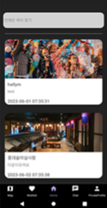
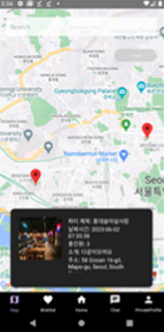
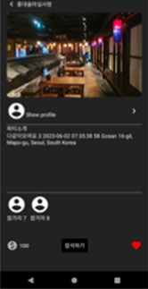
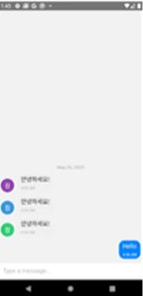

# Party UP - 일상이 파티가 되다
 

- 문의 & 아이디어 제보 (<rladudcks5477@gmail.com>)

Party UP은 한림대학교 SW캡스톤 디자인 수업에서 진행한 프로젝트입니다. 또한 Party UP은 일상이 지루한 사용자들을 위한 익명 파티 주최/참석이 가능한 어플리케이션입니다.

## 개발자
- 김영찬, 지혁준 - Frontend
- 이강훈, 지채영 - Backend

## 핵심기능
- 누구나 파티를 주최 기능
- 집, Bar, 클럽 어느 곳이든 파티 장소 선정 가능
- 파티를 주최하여 평가가 좋을 수록 레벨이 상승하여 참석 인원을 늘리는 기능
- 내 위치 기준 파티 검색 기능
- Party 코인을 얻어 화폐 교환 기능
- 안전 보장을 위한 사용자 인증 기능

   

## 사용된 프로그램
### Frontend
- [React-Native](https://reactnative.dev/)
- JavaScript
- [Google Maps Platform](https://developers.google.com/maps?hl=ko)
### Backend
- Java
- [Springboot](https://spring.io/projects/spring-boot)
- [MariaDB](https://mariadb.org/)
- [AWS-S3,EC2,RDS](https://aws.amazon.com/ko/free/?trk=fa2d6ba3-df80-4d24-a453-bf30ad163af9&sc_channel=ps&ef_id=Cj0KCQjw4NujBhC5ARIsAF4Iv6fxjgIEQiL0NKN6kqftH1qaLBvA8uE0Wqf3yhbgC6V9We2rqcbLYF4aAga5EALw_wcB:G:s&s_kwcid=AL!4422!3!563761819834!e!!g!!aws!15286221779!129400439466)
